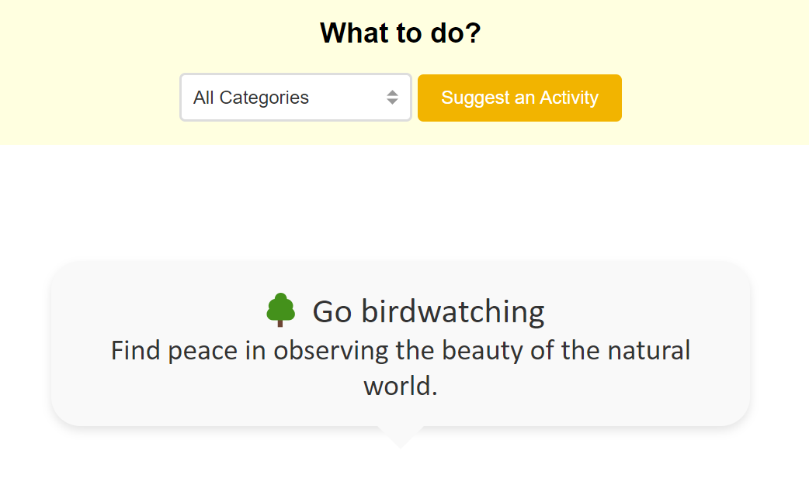

# My Activity Suggester

## Overview

My Activity Suggester is a web application designed to help users discover fun and engaging activities based on their interests. Whether you're looking for something to do outdoors, indoors, or something creative or relaxing, this app provides random activity suggestions tailored to your selected category.

## Features

- **Activity Suggestions:** Provides a list of activities categorized into outdoor, indoor, creative, and relaxing.
- **Dynamic Filtering:** Allows users to filter activities based on their chosen category.
- **Random Activity Generation:** Suggests a random activity from the selected category each time the user clicks the "Suggest an Activity" button.
- **Emoji Integration:** Displays a relevant emoji alongside each activity to enhance user experience and provide visual context.
- **Responsive Design:** Adapts to various screen sizes to ensure a seamless experience across devices.

## Technologies Used

- **React:** A JavaScript library for building user interfaces, used to create and manage the application's components and state.
- **CSS Modules:** For styling the application with modular, scoped CSS, ensuring styles are encapsulated and do not conflict.
- **JavaScript:** The primary programming language used for the app's logic and functionality.
- **JSON:** Used to store and manage the list of activities and their categories.
- **HTML:** The standard markup language used to structure the app's content.
